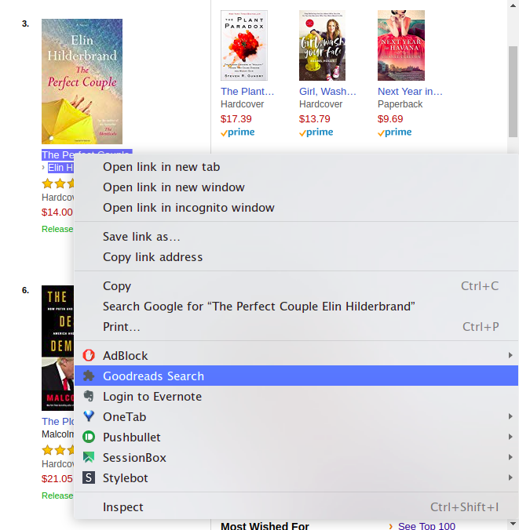
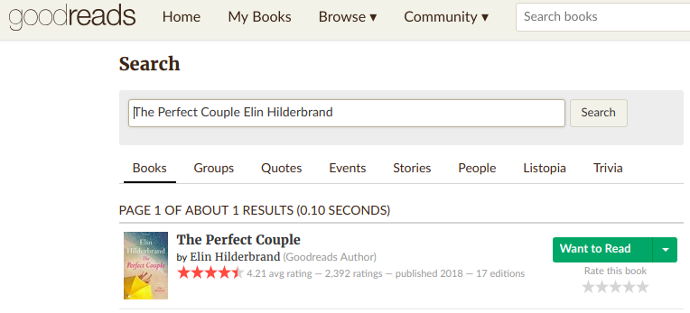

<div align="center"></div>

<h3 align="center">Search on Goodreads</h3>

<div align="center">
    
    
</div>

------


<p align="center">Chrome extension to search the selected text on Goodreads.</p>

## 🔧 Setup 

1. Download the code of the repository.

   ```bash
   git clone https://github.com/pauladj/goodreads-search.git
   ```

2. Go to "Manage extensions" in Google Chrome.
3. Activate developer mode in the upper right corner.
4. Click on load extension and select the code folder.
5. The extension should be loaded now.


## 🎈 Usage 

1. Highlight the text you want to search on Goodreads
2. Left-click and "Goodreads Search". 

<div align="center">
&nbsp;&nbsp;&nbsp;
</div>

